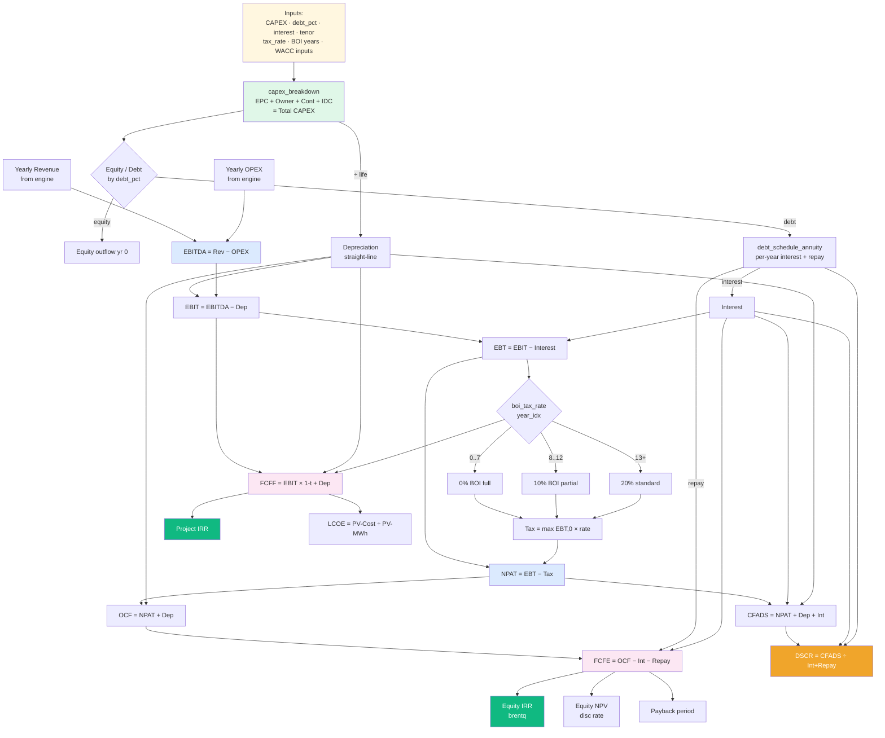
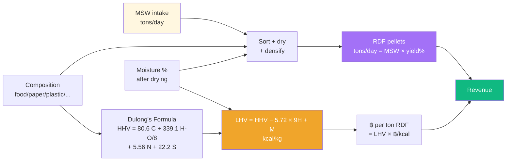
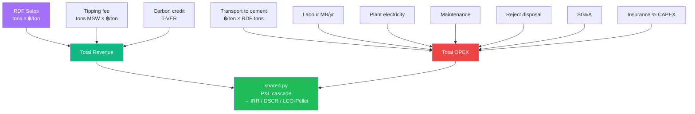
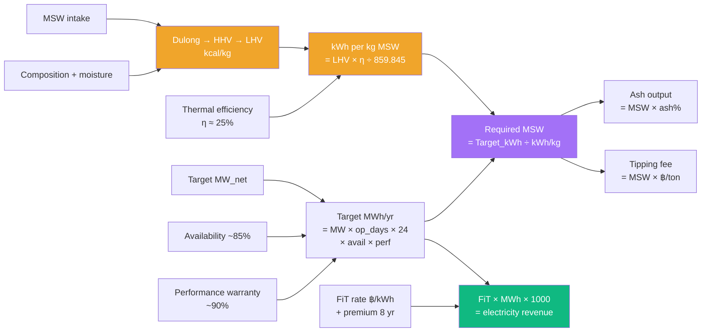
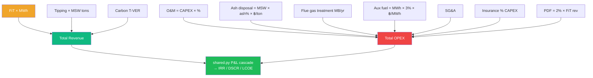
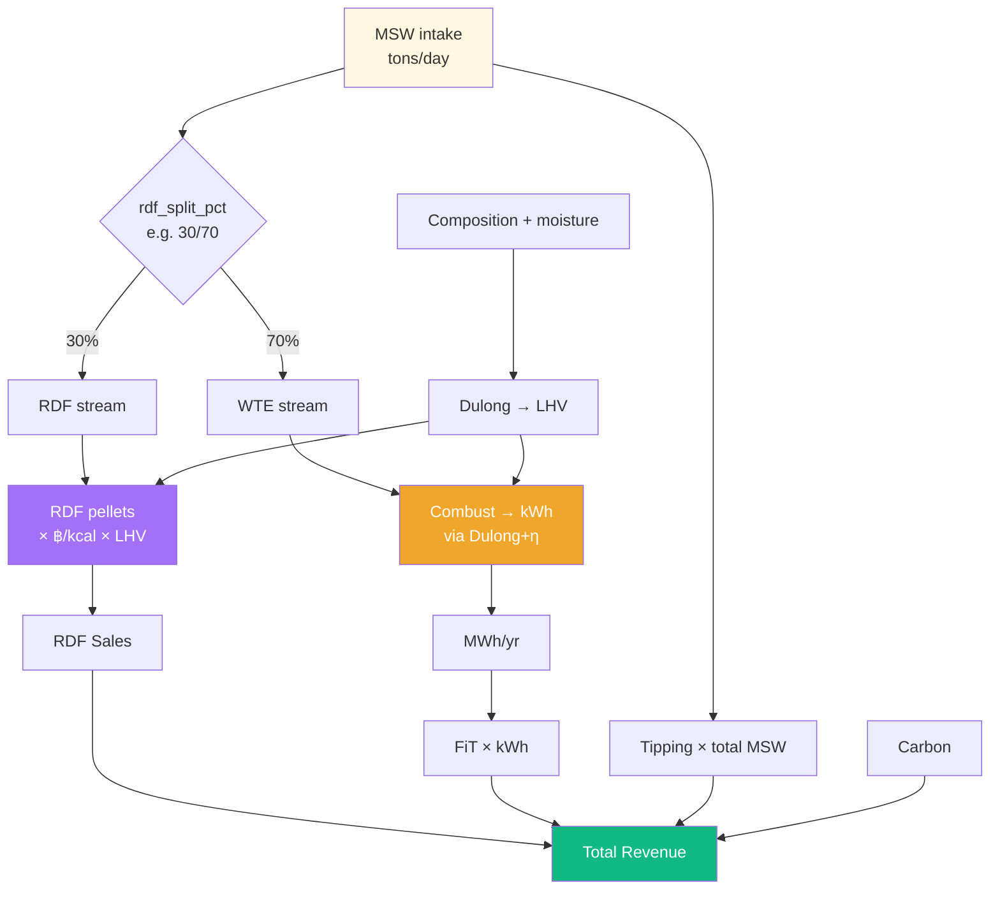
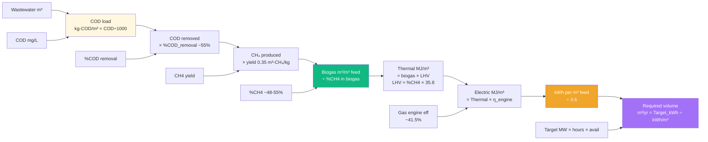
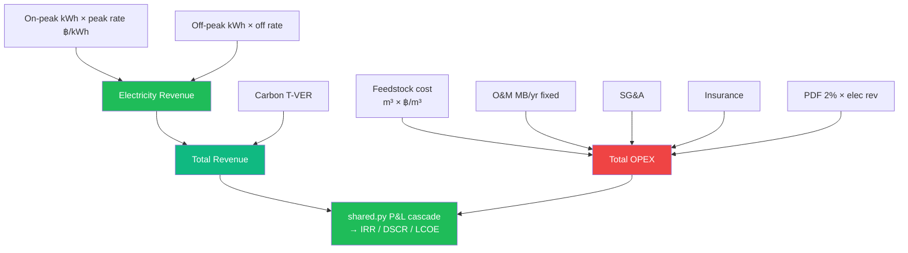
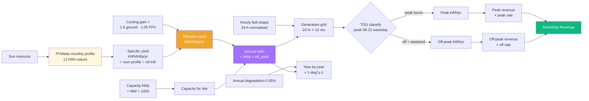
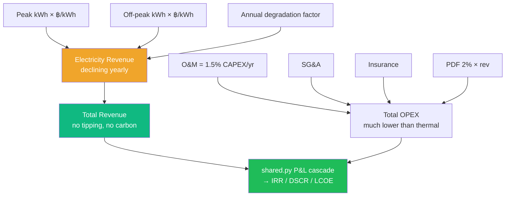

# 📊 FeasFlow — Engine Calculation Flowcharts

Process flow for each of the 5 engines: **technical** (raw material → energy/product)
**+ financial** (revenue → P&L → cashflow → IRR/NPV/DSCR).

Use this as the **spec** when iterating math in each `engines/<name>.py`.

---

## 🔁 Common Financial Cascade (shared by ALL engines)

Every engine, after computing plant-specific revenue/opex, feeds into the same
financial machine. This part lives in `engines/shared.py` — DO NOT duplicate per engine.



### Per-year formulas (run inside `for y in range(project_life)`)

| Step | Formula | Notes |
|---|---|---|
| Depreciation | `dep = capex_total / project_life` | constant straight-line |
| EBITDA | `revenue − opex` | engine-specific rev & opex |
| EBIT | `EBITDA − dep` | |
| Interest | `ds[y][0]` from annuity schedule | falls each year |
| Principal | `ds[y][1]` from annuity schedule | rises each year |
| EBT | `EBIT − interest` | |
| Tax rate (BOI) | `0% (0..7) → 10% (8..12) → 20% (13+)` | from `boi_tax_rate(y, ...)` |
| Tax | `max(EBT, 0) × tax_rate` | losses don't get refunded |
| NPAT | `EBT − tax` | |
| OCF | `NPAT + dep` | depreciation non-cash add-back |
| CFADS | `NPAT + dep + interest` | for DSCR |
| DSCR | `CFADS / (interest + principal)` | bank requires ≥ 1.30 |
| FCFE | `OCF − interest − principal` | to equity holders |
| FCFF | `EBIT × (1 − tax) + dep` | to firm (before debt) |

### KPI rollup (after the 20-25 year loop)

| KPI | Formula |
|---|---|
| Project IRR | `irr_brentq(fcff)` where fcff[0] = −total_capex |
| Equity IRR | `irr_brentq(fcfe)` where fcfe[0] = −equity |
| NPV (equity) | `npv_calc(fcfe, disc_rate)` |
| Payback | year cumulative FCFE turns ≥ 0 (linear-interp) |
| BCR | `PV(revenue) / PV(opex + dep)` |
| LCOE | `(CAPEX_MB + PV(OPEX_MB)) × 1000 / PV(MWh)` |
| WACC | `E/V × Ke + D/V × Kd × (1−t)` where `Ke = Rf + β_levered × MRP` |

---

# 🗑️ Engine 1 — RDF (sell to cement)

**Key insight**: NO ELECTRICITY. Revenue = sell RDF pellets to cement plants
priced on heat content (`฿/kcal × LHV`).

## Technical flow



### ASCII

```
MSW intake (tons/day)
  + Composition (% food, paper, plastic, ...)
  + Moisture % (after drying, ~20%)
        │
        ├──→ Sorting + drying + densification
        │       │
        │       └──→ RDF pellets (tons/day) = MSW × rdf_yield_pct
        │
        └──→ Dulong's Formula
                  ├── HHV (dry) = 80.6·C + 339.1·(H − O/8) + 5.56·N + 22.2·S
                  └── LHV (wet) = HHV − 5.72·(9·H + Moisture)
                                   │
                                   └──→ RDF price (฿/ton) = LHV × ฿/kcal
                                              │
                                              └──→ RDF Revenue (MB/yr)
                                                  + Tipping fee (paid by LAO)
                                                  + Optional Carbon credit
```

## Financial integration



### Key parameters

| Parameter | Typical | Where in code |
|---|---|---|
| `msw_intake_design_t_d` | 240 | RDFInputs |
| `rdf_yield_pct` | 1.0 (100% mass retained) | RDFInputs |
| `msw_pct_*` (composition) | high plastic (50%) for high LHV | RDFInputs |
| `msw_moisture` | 0.20 (lower than raw MSW — dried) | RDFInputs |
| `rdf_price_thb_per_kcal` | 0.20 ฿/kcal | RDFInputs |
| `transport_to_cement_thb_per_ton` | 260 | RDFInputs |
| Cost metric | **LCO-Pellet** (฿/ton RDF) — not LCOE | shared.lcoh_thb_per_ton |

---

# 🔥 Engine 2 — WTE (MSW → electricity)

**Key insight**: Burn MSW for steam → turbine → electricity. Revenue = FiT × kWh + tipping fee.

## Technical flow



### ASCII

```
MSW Composition + Moisture
        │
        └──→ Dulong → HHV → LHV (kcal/kg)
                              │
                              └──→ kWh/kg MSW = LHV × η ÷ 859.845

Target MW_net × op_days × 24 × avail × perf
        │
        └──→ Target MWh/yr
                  │
                  ├──→ Required MSW (tons/yr) = Target_kWh ÷ (kWh/kg × 1000)
                  │       │
                  │       ├──→ Tipping fee revenue
                  │       └──→ Ash output (× 800 ฿/ton disposal cost)
                  │
                  └──→ FiT revenue = MWh × 1000 × (fit_base + premium if y<8) ÷ 1e6
```

## Financial integration



### Key parameters

| Parameter | Typical | Where in code |
|---|---|---|
| `mw_net` | 1.5 – 9.5 MW | WTEInputs |
| `efficiency` | 0.25 (thermal-electric) | WTEInputs |
| `availability` | 0.85 | WTEInputs |
| `performance_warranty` | 0.90 | WTEInputs |
| `fit_base` | 5.78 (community VSPP) or 6.08 (industrial) | WTEInputs |
| `fit_premium` | 0.70 (first 8 yr) | WTEInputs |
| `tipping_fee` | 400 ฿/ton | WTEInputs |
| `ash_pct` | 0.20 | WTEInputs |
| Cost metric | **LCOE** (฿/kWh) | shared.lcoe_thb_per_kwh |

---

# 🔄 Engine 3 — RDF + WTE (combined)

**Key insight**: MSW split into 2 streams — RDF sold + remainder burned.

## Technical flow



### ASCII

```
MSW intake (e.g. 500 t/d × util × avail × op_days)
        │
        ├── 30% → RDF stream → RDF tons × ฿/ton (LHV × ฿/kcal) → RDF Revenue
        │
        └── 70% → WTE stream → kWh = mass × LHV × η ÷ 859.845
                                       │
                                       └──→ MWh/yr × FiT → Electricity Revenue
        │
        └── 100% MSW × tipping fee → Tipping Revenue

Revenue = RDF Sales + Electricity + Tipping + Carbon
OPEX    = O&M + Ash + Flue + Aux + RDF Transport + SG&A + Insurance + PDF
```

### Key parameters

| Parameter | Typical | Where |
|---|---|---|
| `rdf_split_pct` | 0.30 (30% to RDF) | RDFWTEInputs |
| `rdf_yield_pct` | 1.0 | RDFWTEInputs |
| Plus all WTE parameters | (FiT, ash, flue, aux ...) | RDFWTEInputs |
| Plus all RDF parameters | (transport, ฿/kcal ...) | RDFWTEInputs |

---

# 🌿 Engine 4 — Biogas (wastewater → CH₄ → electricity)

**Key insight**: COD chain — chemistry-driven feedstock requirement.

## Technical flow



### ASCII

```
Wastewater (m³/day) × COD (mg/L)
        │
        ↓ ÷ 1,000  →  COD load (kg-COD/m³ vinasse)
        ↓ × %COD_removal  →  COD removed (kg/m³)
        ↓ × CH₄_yield (0.35)  →  m³-CH₄/m³ vinasse
        ↓ ÷ %CH₄ in biogas  →  Biogas m³ per m³ vinasse
        ↓ × LHV (≈ %CH4 × 35.8 MJ/Nm³)
              ↓
              Thermal MJ per m³ vinasse
              ↓ × η_engine (~0.415)
              Electric MJ per m³ vinasse
              ↓ ÷ 3.6
              kWh per m³ vinasse

Target MW × op_days × 24 × avail × perf  =  Target MWh/yr
        ↓ × 1000
        ↓ ÷ (kWh per m³ vinasse)
Required vinasse (m³/yr) → m³/day
        ↓ × material_cost (฿/m³) = Annual feedstock cost
```

## Financial integration



### Key parameters

| Parameter | Typical | Notes |
|---|---|---|
| `cod_mg_per_l` | 150,000 – 250,000 | depends on source |
| `ch4_pct` | 0.48 – 0.55 | biogas composition |
| `cod_removal_pct` | 0.55 | anaerobic efficiency |
| `ch4_yield_m3_per_kg` | 0.35 | theoretical |
| `gas_engine_efficiency` | 0.415 | electrical |
| `on_peak_price` / `off_peak_price` | 4.22 / 2.36 ฿/kWh | PEA TOU |
| `on_peak_ratio` | 0.398 (132.5 / 333 days) | PEA calendar |
| `material_cost_thb_per_m3` | 25 – 75 | depends on source |

---

# ☀️ Engine 5 — Solar PV (PVWatts + TOU)

**Key insight**: Resource = sunlight (free). Use PVWatts monthly profile × hourly bell × TOU split.

## Technical flow



### ASCII

```
PVWatts monthly profile (NSRDB) — 12 monthly kWh for a 400 kW reference
        │
        ↓ ÷ ref_kW  →  Specific yield (kWh/kWp/yr)
        ↓ × cooling_gain (1.0 ground / 1.05 FPV)
        Effective yield (kWh/kWp/yr)
        ↓ × capacity_kwp (= MW_net × 1000)
        Annual kWh (Year 1)

Hourly bell shape (24 values, normalised to sum = 1.0)
        × Annual kWh × monthly share × days_in_month
        24×12 generation grid (kWh per hour per typical day in each month)
        │
        ↓ classify each hour: peak (09-22 weekday) vs off-peak
        ↓ × weekdays_per_year (261) / weekend_days (104)
        Peak kWh/yr  +  Off-peak kWh/yr

Year y generation = Year 1 × (1 − annual_degradation)^(y−1)
Revenue y = Peak × peak_rate + Off-peak × off_rate (no escalation by default)
```

## Financial integration



### Key parameters

| Parameter | Typical | Notes |
|---|---|---|
| `mw_net` | 2.0 MW | capacity_kwp = MW × 1000 |
| `cooling_gain_factor` | 1.00 ground / 1.05 FPV | floating bonus |
| `pvwatts_monthly_kwh` | 12-array for ref site | Nakhon Si Thammarat default |
| `peak_rate` / `offpeak_rate` | 4.40 / 2.80 ฿/kWh | PEA large-service |
| `peak_start_hour` / `peak_end_hour` | 9 / 22 | TOU window |
| `weekdays_per_year` / `weekend_days_per_year` | 261 / 104 | calendar |
| `annual_degradation` | 0.0055 (0.55%/yr) | year-2 onwards compounding |

---

# 📊 Cross-Engine Comparison

| Aspect | RDF | WTE | RDF+WTE | Biogas | Solar |
|---|---|---|---|---|---|
| **Raw material** | MSW | MSW | MSW | Wastewater | Sunlight |
| **Output** | Pellets | Electricity | Both | Electricity | Electricity |
| **Revenue type** | ฿/ton × LHV | FiT × kWh + tipping | Both | TOU × kWh | TOU × kWh |
| **Chemistry chain** | Dulong → LHV | Dulong → LHV → kWh/kg | Dulong (both sides) | COD chain → CH₄ → kWh | PVWatts profile |
| **Required volume calc** | Manual MSW input | Back-calc from MW | Manual + split | Back-calc m³ from MW | None (capacity-driven) |
| **CAPEX class** | Small (~80 MB) | Big (200-300 MB/MW) | Biggest (combined) | Medium (~80 MB/MW) | Small (~30 MB/MW) |
| **OPEX heavy in** | Transport, labour | Ash, flue, O&M | Ash + transport | Feedstock, O&M | O&M only |
| **Cost metric** | **LCO-Pellet** | LCOE | LCOE | LCOE | LCOE |
| **Carbon credit** | ✅ avoided landfill | ✅ avoided landfill | ✅ | ✅ avoided methane WW | ❌ (no avoided) |
| **TOU pricing** | ❌ flat ฿/ton | Single FiT | Single FiT | ✅ peak/off-peak | ✅ peak/off-peak |
| **Degradation** | — | — | — | — | ✅ 0.55%/yr |

---

# 🛠️ How to use this spec for engine iteration

For each engine, when you want to **refine the math**:

1. **Open the engine file** — `engines/<name>.py`
2. **Find the relevant function**:
   - `compute_raw_material(p)` — chemistry/resource chain (top of flow)
   - `_yearly_revenue(p, y, ...)` — revenue formulas
   - `_yearly_opex(p, y, ...)` — OPEX components
   - `run_model(p)` — orchestrator (DON'T usually change — it just calls the above)
3. **Compare against this flowchart**:
   - Does each box match a function/variable in the code?
   - Are formulas correct (Dulong constants, CH₄ yield, etc.)?
   - Are units consistent (kcal vs MJ vs kWh vs ฿)?
4. **Update + test**:
   - Modify code
   - Run `python -m engines.<name>` for CLI smoke test
   - Run `streamlit run feas_streamlit.py` for full GUI test
5. **Validate KPIs** against reference cases (see `session_progress.md`)

---

# 🔗 Related files

| File | Contains |
|---|---|
| `engines/shared.py` | Common financial cascade (P&L, IRR, DSCR, WACC, debt schedule, Dulong, MSW chemistry DB, T-VER carbon) |
| `engines/rdf.py` | RDF technical chain + revenue/opex |
| `engines/wte.py` | WTE technical chain + revenue/opex |
| `engines/rdf_wte.py` | Combined |
| `engines/biogas.py` | COD chain + biogas + TOU revenue |
| `engines/solar.py` | Wraps `solar_generation_engine.py` |
| `solar_generation_engine.py` | Pure-logic PVWatts + hourly bell + TOU split |
| `feas_main.py` | Tkinter desktop GUI |
| `feas_streamlit.py` | Web GUI (Streamlit) |
| `feas_excel.py` | Excel report exporter |
| `feas_pdf.py` | PDF report exporter |
