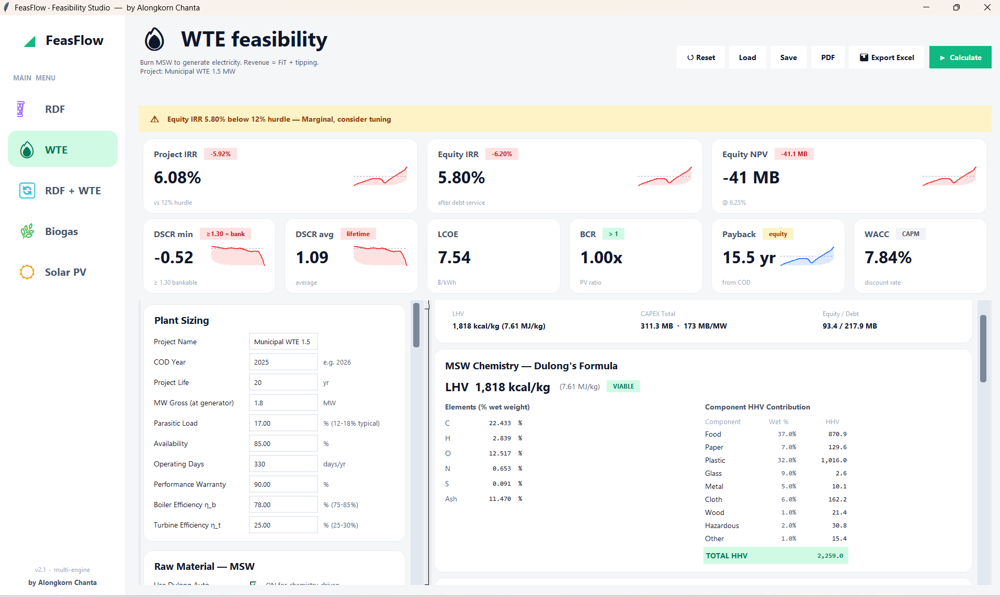
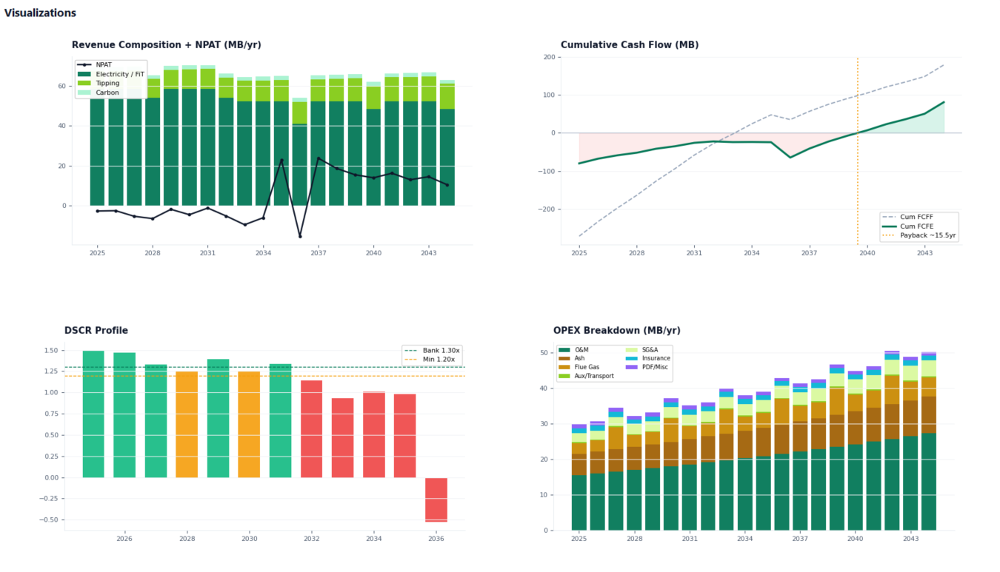
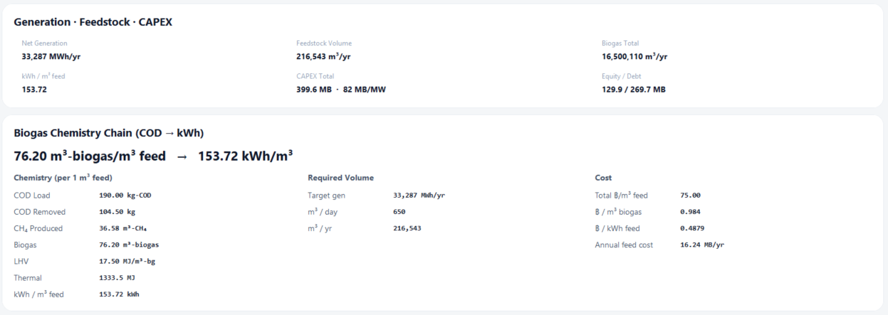

# FeasFlow — Power-Plant Feasibility Studio

**Multi-engine feasibility model for Thai waste-to-energy & renewable projects.**
Model five plant types — **RDF · WTE · RDF+WTE · Biogas · Solar PV** — from raw
material and plant chemistry all the way to a bankable financial verdict
(IRR, NPV, DSCR, LCOE, payback), with a clean desktop GUI and a web version.

> โปรแกรมศึกษาความเป็นไปได้โรงไฟฟ้า (RDF / WTE / RDF+WTE / Biogas / Solar)
> กรอกค่า → กด Calculate → ได้ IRR / NPV / DSCR / กระแสเงินสด พร้อมกราฟและ export Excel/PDF

*by **Alongkorn Chanta** · © 2026*

---



---

## What it does

Each plant type is a **self-contained engine** that starts from its own raw
material (not a one-size formula) and builds up to the same financial output
schema, so results are comparable across technologies:

| Engine | Starts from | Revenue drivers |
|--------|-------------|-----------------|
| **RDF** | MSW mix → dried refuse-derived fuel | RDF sales (฿/kcal by quality tier) + tipping fee |
| **WTE** | MSW combustion → steam → power | FiT electricity + tipping fee |
| **RDF + WTE** | 3-way split: sell RDF / burn / reject | RDF sales + FiT electricity + tipping |
| **Biogas** | wastewater COD → CH₄ → power | TOU electricity + REC (optional) |
| **Solar PV** | PVWatts irradiance → AC energy | TOU electricity (ground or floating FPV) |

Type the parameters, press **Calculate**, and every KPI, cash-flow table and
chart updates. Hover any parameter name for a tooltip explaining what it means,
its typical range, and how it moves the result.

## Methodology (what's under the hood)

The calculation chain is verified formula-by-formula against textbook standards
(see [`CORRECTNESS_AUDIT.md`](CORRECTNESS_AUDIT.md); run `python audit_correctness.py`
→ 59 checks pass):

- **Fuel chemistry** — Dulong's formula (Channiwala coefficients) for HHV, LHV
  from moisture (ISO 1928), MSW composition → C/H/O/N/S.
- **Biogas** — COD → CH₄ (0.35 m³/kg-COD theoretical) → biogas → kWh chain.
- **Solar** — PVWatts monthly profile × Performance Ratio breakdown, LID +
  annual degradation, inverter replacement, TOU peak/off-peak split.
- **Finance** — WACC via CAPM (levered β), annuity debt schedule, DSCR, BCR,
  LCOE / LCO-pellet, NPV, IRR (bisection) with **MIRR fallback**.
- **Tax realism** — BOI holiday cascade (0% → partial → full CIT), separate
  **tax depreciation life**, and **tax-loss carry-forward (NOL, 5 yr)**.
- **CAPEX build-up** — EPC + owner + contingency + IDC (drawdown) + working
  capital + DSRA + decommissioning.

> Parameters are starting assumptions for a *base case* — tune them to your own
> project. The point is a **correct method**, not a fixed answer.

## Screenshots

**Financial visualizations** — revenue composition + NPAT, cumulative cash flow
(with the payback marker), DSCR profile against the 1.30 bank line, and the
year-by-year OPEX breakdown:



**Biogas engine** — the transparent COD → CH₄ → biogas → kWh chemistry chain
that drives generation, feedstock and CAPEX:



KPI cards also carry meaningful sparklines: return / NPV / payback show
**cumulative cash flow** (crossing the dashed 0-line = paid back); DSCR shows the
**year-by-year profile** against the dashed 1.30 bank threshold.

## Run it

### A) Web (no install) — Streamlit
Deployed from this repo; open the public URL in any browser. To run locally:
```bash
pip install -r requirements.txt
streamlit run feas_streamlit.py
```

### B) Desktop from source (Python 3.11+)
```bash
pip install -r requirements.txt
python feas_main.py
```

### C) Windows — one-click installer / portable
No Python needed. Build the artifacts yourself with:
```bat
build_installer.bat
```
→ produces `Output\FeasFlow_Setup.exe` (installer, no admin rights required) and
a portable `dist\FeasFlow\` folder.

> The `.exe`/installer is **not code-signed**, so Windows SmartScreen may warn
> ("More info → Run anyway"), and a managed corporate antivirus may block
> unknown executables — in that case use the **web version** or ask IT to
> allow-list it.

## Project layout

```
engines/            self-contained calculation engines (+ shared.py math library)
  shared.py         IRR/NPV/DSCR/LCOE, WACC-CAPM, debt schedule, CAPEX,
                    Dulong/LHV, carbon, NOL, MIRR, sensitivity, Monte Carlo
  rdf / wte / rdf_wte / biogas / solar .py
feas_main.py        desktop GUI (Tkinter)
feas_streamlit.py   web GUI (Streamlit)
feas_help.py        per-parameter guidance shown as tooltips
feas_theme.py       theme, cards, sparklines, chart styling
feas_excel.py       Excel report export      feas_pdf.py  PDF report export
audit_correctness.py / CORRECTNESS_AUDIT.md  methodology verification
FeasFlow.spec / *_installer.iss / build_*.bat  packaging
```

## Notes

- Outputs are estimates for feasibility screening — validate assumptions against
  your real project before any investment decision.
- Not investment advice.

---

© 2026 **Alongkorn Chanta**. All rights reserved.
